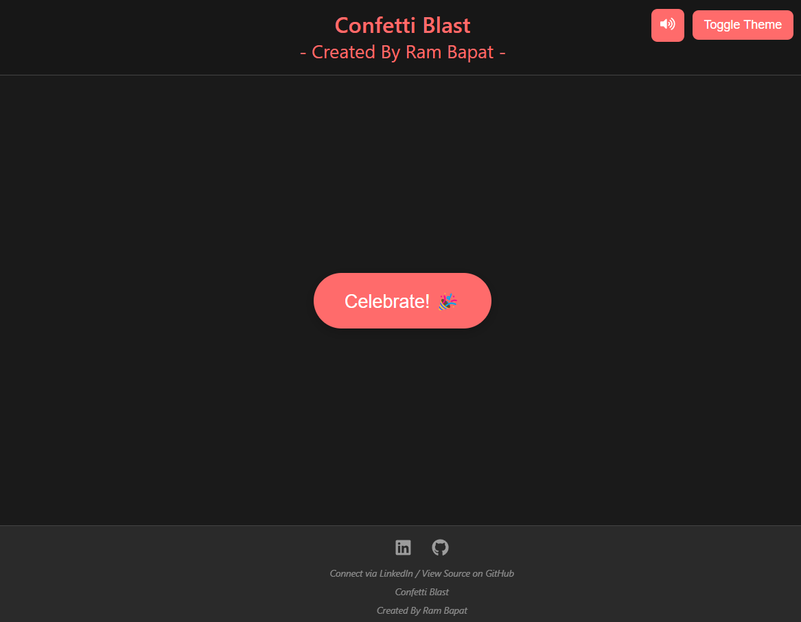
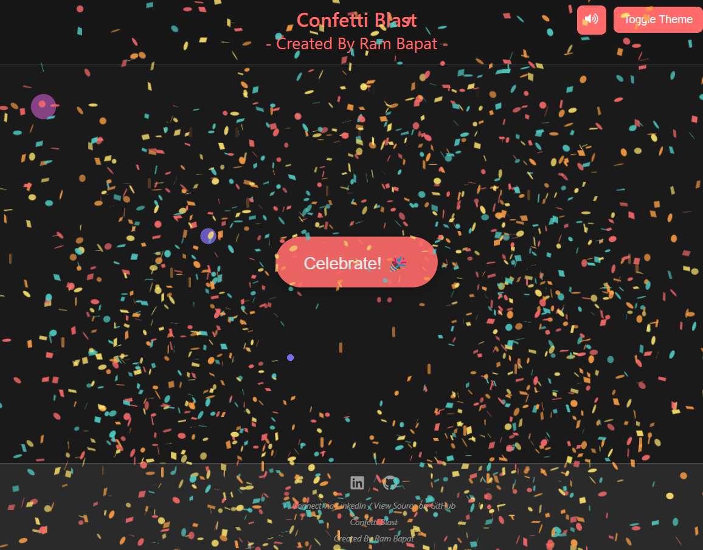
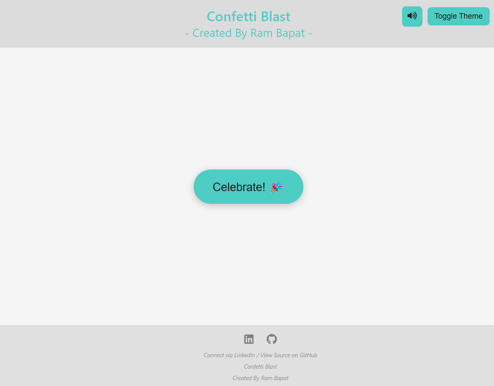

# Confetti Blast Celebration App (React + Vite) 🎉💥🔊

## Try live demo - [Demo](PLACEHOLDER_LINK_TO_YOUR_VERCEL_DEPLOYMENT_HERE)

A fun, interactive web application built with React and Vite that triggers confetti, CSS fireworks, and sound effects on button click. Features dark/light theme toggling and a mute option. Developed as part of the #30DaysOfVibeCoding challenge using AI assistance.

<!-- ================================================== -->

 
 


<!-- ================================================== -->

## Overview

This project is a simple yet engaging web app designed to provide a satisfying visual and auditory celebration effect. Clicking the central "Celebrate!" button triggers:

*   A vibrant burst of confetti originating from the button's center, using the `canvas-confetti` library.
*   A series of CSS-animated fireworks launching from the bottom of the screen.
*   A cheerful celebration sound effect.

The application also includes:

*   **Theme Toggling:** Switch between dark and light modes using a dedicated button. The UI adapts using CSS custom properties.
*   **Mute Functionality:** A mute button allows users to toggle the celebration sound on or off.
*   **Fixed Layout:** The header and footer remain fixed, while the main content area is centered vertically and horizontally with no page scrolling.
*   **Responsive Design:** Adapts cleanly to different screen sizes, adjusting button positions and header text alignment on mobile.

This project was developed as Day [4](Link) of the **#30DaysOfVibeCoding** challenge (April 2025), leveraging AI assistance for brainstorming, code generation, debugging, and refinement, following the principles of **#VibeCoding**.

## Features

*   **Interactive Celebration Button:** The core trigger for all effects.
*   **Circular Confetti Burst:** Uses `canvas-confetti` for a dynamic, multi-shot confetti explosion centered on the button.
*   **CSS-Based Fireworks Animation:** Custom CSS keyframe animations create a launching and bursting firework effect.
*   **Audio Feedback:** Plays an `.mp3` sound effect upon celebration (can be muted).
*   **Mute Toggle:** Button using `react-icons` to enable/disable the celebration sound.
*   **Dark/Light Theme Toggle:** Easily switch UI themes using CSS Variables.
*   **Fixed Header & Footer:** Provides consistent framing for the application. Includes project title in the header and social links (`react-icons`) in the footer.
*   **No-Scroll Responsive Layout:** Content is centered within the viewport using Flexbox, ensuring a clean look without scrolling on any device size.
*   **Modern Tech Stack:** Built with React, Vite, and modern CSS.
*   **AI-Assisted Development:** Utilized AI tools throughout the development process as part of the #VibeCoding challenge.

## Tech Stack

*   **Frontend:** React 18+
*   **Build Tool:** Vite
*   **Styling:** CSS3 (including Flexbox, Custom Properties/Variables, Keyframe Animations)
*   **Language:** JavaScript (ES6+)
*   **Confetti Library:** `canvas-confetti`
*   **Icons:** `react-icons`
*   **Package Manager:** npm

## Getting Started

To get a local copy up and running, follow these simple steps.

### Prerequisites

*   Node.js (which includes npm) installed on your system. Version 18+ recommended. You can download it from [nodejs.org](https://nodejs.org/).
*   Git (for cloning the repository).

### Installation & Setup

1.  **Clone the repository:**
    ```bash
    git clone https://github.com/Barrsum/Confetti-Blast-Celebration-App.git
    ```

2.  **Navigate to the project directory:**
    ```bash
    cd Confetti-Blast-Celebration-App
    ```

3.  **Install NPM packages:**
    ```bash
    npm install
    ```

4.  **Ensure Audio File:**
    Make sure the `celebration-sound.mp3` file (or your chosen audio file) is placed inside the `/public` directory of the project.

### Running the Project

1.  **Start the development server:**
    ```bash
    npm run dev
    ```
    This command will start the Vite development server.

2.  **Open the application:**
    Open your web browser and navigate to the local URL provided by Vite (usually `http://localhost:5173/` or a similar port).

## Deployment

This project is ready for deployment on platforms like Vercel or Netlify. Connect your Git repository to the platform and follow their instructions for deploying a Vite/React application. Usually, the build command is `npm run build` and the output directory is `dist`.

## Contributing

Contributions, issues, and feature requests are welcome! Feel free to check the [issues page](https://github.com/Barrsum/Confetti-Blast-Celebration-App/issues).

1.  Fork the Project
2.  Create your Feature Branch (`git checkout -b feature/AmazingFeature`)
3.  Commit your Changes (`git commit -m 'Add some AmazingFeature'`)
4.  Push to the Branch (`git push origin feature/AmazingFeature`)
5.  Open a Pull Request

## License

Distributed under the MIT License. See `LICENSE.md`

## Acknowledgements

*   **Confetti:** [canvas-confetti](https://github.com/catdad/canvas-confetti) library by @catdad.
*   **Icons:** Provided by [React Icons](https://react-icons.github.io/react-icons/).
*   **Sound Effect:** Sourced from [Mixkit](https://assets.mixkit.co/active_storage/sfx/2991/2991-preview.mp3).
*   **React:** [react.dev](https://react.dev/)
*   **Vite:** [vitejs.dev](https://vitejs.dev/)
*   **Vibe Coding:** This project embraces the spirit of #VibeCoding, using AI as a development partner.

---

Built by Ram Bapat - Challenge [\#30DaysOfVibeCoding](https://www.linkedin.com/posts/ram-bapat-barrsum-diamos_vibecoding-ai-machinelearning-activity-7312839191153860608-wQ8y?utm_source=share&utm_medium=member_desktop&rcm=ACoAAEokGUcBG1WEFP4A_IMlyO4LNl-eu2MD52w) - [LinkedIn Profile](https://www.linkedin.com/in/ram-bapat-barrsum-diamos)